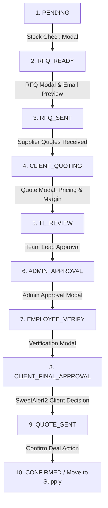

# Trading Bot Detailed Page Operations Documentation

This document provides a exhaustive, step-by-step technical mapping of the operations, state transitions, data flows, and interactive models for every page/module within the **Trading Bot Dashboard**.

---

## Table of Contents
1. [User Authentication & Access Control (Login)](#1-user-authentication--access-control-login)
2. [Executive Dashboard](#2-executive-dashboard)
3. [Central Deal Pipeline (Inquiries)](#3-central-deal-pipeline-inquiries)
4. [Logistics & Supply Chains](#4-logistics--supply-chains)
5. [Purchase Orders (PO)](#5-purchase-orders-po)
6. [Billing & Invoicing](#6-billing--invoicing)
7. [Employee & Attendance Registry](#7-employee--attendance-registry)
8. [Bank Accounts Management](#8-bank-accounts-management)
9. [Inventory & Stock Ledger](#9-inventory--stock-ledger)
10. [Financial Audits & Profit Tracking](#10-financial-audits--profit-tracking)
11. [Compliance & Document Kanban](#11-compliance--document-kanban)
12. [System Notifications Feed](#12-system-notifications-feed)
13. [Daily Planner & Team Memories](#13-daily-planner--team-memories)
14. [Master Configuration & Role Permissions (Settings)](#14-master-configuration--role-permissions-settings)
15. [User Profile Center](#15-user-profile-center)

---

## 1. User Authentication & Access Control (Login)
*   **File Path**: [LoginPage.jsx](file:///c:/Users/HP/Desktop/trading-bot/web/src/features/auth/LoginPage.jsx)
*   **Access Type**: Public Route (Unauthenticated fallback)
*   **Visual Structure**: High-end glassmorphic login card with interactive glowing background bubbles, adaptive fields, validation labels, and loading button transitions.

### Operational Mechanics & Logic
1.  **Form Input Binding**: Uses local state variables for `email` and `password`.
2.  **Submit Interception**: On submit, inputs are validated:
    *   Verifies email format matches standard regex (`/^[^\s@]+@[^\s@]+\.[^\s@]+$/`).
    *   Verifies password length is $\ge 6$ characters.
3.  **Authentication Simulation & Sessioning**:
    *   Matches credentials against static mock roles (e.g., `admin@trademind.com` -> Admin role, `employee@trademind.com` -> Employee role).
    *   Invokes the `login(profile)` method of `AuthContext`.
    *   Writes `is_auth: "true"` and `user_profile: { "name": "...", "role": "...", "email": "..." }` into `localStorage`.
4.  **Route Redirection**: The `App` router listens to changes in `isAuthenticated` and performs a router-level replacement, pushing the user to `/` (Dashboard).

---

## 2. Executive Dashboard
*   **File Path**: [DashboardPage.jsx](file:///c:/Users/HP/Desktop/trading-bot/web/src/features/dashboard/DashboardPage.jsx)
*   **Access Type**: Protected Route (Inside `AppShell`)
*   **Visual Structure**: Core statistics panel, Recent Inquiries data table, and Weekly Profit Trend chart (using Recharts).

### Operational Mechanics & Logic
1.  **Initial Page Load**:
    *   Triggers concurrent API requests `fetchInquiries()` and `fetchProfitData()` to retrieve real-time transaction updates.
    *   Displays a 4-card animated skeleton loader during data fetching.
2.  **Metrics Aggregation (Memoized)**:
    *   **Total Inquiries Today**: Filters inquiries where the creation date matches the current ISO date (`YYYY-MM-DD`). Clicking this navigates to `/inquiries` with a state payload of `{ filter: "All", date: "today" }`.
    *   **Quotes Sent**: Tallies all inquiries in `QUOTE_SENT` or `CLOSED` statuses. Clicking navigates to `/inquiries` with state `{ filter: "QUOTE_SENT_ONLY" }`.
    *   **Pending Replies**: Tallies inquiries with active actions remaining (`PENDING` or `RFQ_SENT`). Clicking navigates to `/inquiries` with state `{ filter: "PENDING_REPLIES" }`.
    *   **Total Profit Today**: Tallies realized revenue minus seller costs for deals closed today. Clicking navigates to `/profit`.
3.  **Recent Inquiries Feed**:
    *   Sorts all active customer inquiries by date received in descending order.
    *   Renders the top 5 records inside the `DataTable` utility, using status badges to mark pipeline states.
4.  **Interactive Refresh**: A manual refresh button toggles an `isRefreshing` animation loop, updates the dashboard state, and prints a time stamp label showing "Last updated: HH:MM".

---

## 3. Central Deal Pipeline (Inquiries)
*   **File Path**: [InquiriesPage.jsx](file:///c:/Users/HP/Desktop/trading-bot/web/src/features/inquiries/InquiriesPage.jsx)
*   **Access Type**: Protected Route (Inside `AppShell`)
*   **Components**: Table/Kanban Switch, [PageToolbar](file:///c:/Users/HP/Desktop/trading-bot/web/src/components/ui/PageToolbar.jsx), [InquiryTable](file:///c:/Users/HP/Desktop/trading-bot/web/src/features/inquiries/components/InquiryTable.jsx), [InquiryKanban](file:///c:/Users/HP/Desktop/trading-bot/web/src/features/inquiries/components/InquiryKanban.jsx), [DealDrawer](file:///c:/Users/HP/Desktop/trading-bot/web/src/features/inquiries/drawers/DealDrawer.jsx), plus five dedicated process modals.



### Detailed Pipeline Operations & State Transitions
1.  **View Selection**: Users can switch between a grid Kanban Board (organized in status lists) and a list Data Table (complete with pagination control, page size adjustments, and search indexing).
2.  **Pipeline Step Actions (`handleAction(deal, status)`)**:
    *   **Phase A: Stock Verification (`PENDING`)**
        *   Action: Opens `StockCheckModal`. Renders item list. User reviews inventory availability, links potential vendors, and specifies requested quantities.
        *   Transition: User submits -> Status advances to `RFQ_READY` with linked vendors written to `selected_suppliers`.
    *   **Phase B: Send RFQ to Vendors (`RFQ_READY`)**
        *   Action: Opens `RFQModal`. Displays checkboxes of selected suppliers.
        *   Transition: Submitting staging details loads the `MultiEmailPreviewModal`. The interface compiles automated subject lines, mail bodies with item specs, and provides "Send Mail" triggers. Moving past the mail preview updates status to `RFQ_SENT` via the n8n automation service.
    *   **Phase C: Quotation Builder (`CLIENT_QUOTING` / `TL_REVIEW`)**
        *   Action: Opens `QuoteModal`. Loads the seller costs provided by suppliers.
        *   Transition (Step 1): The operator keys in raw unit prices. Submitting updates status to `TL_REVIEW` (Team Lead Review).
        *   Transition (Step 2): The Team Lead enters the target profit margin (%) or discount (%). The pricing engine applies pricing rules (Category, Tier-based, or volume markup) and rounds values to the nearest ₹10. Submitting routes the deal to `ADMIN_APPROVAL`.
    *   **Phase D: Admin Authorization (`ADMIN_APPROVAL`)**
        *   Action: Opens `AdminApprovalModal`. Admins can inspect calculations, override profit margins, configure customized discounts, or authorize the quote.
        *   Transition: Approving advances status to `EMPLOYEE_VERIFY`.
    *   **Phase E: Final Verification (`EMPLOYEE_VERIFY`)**
        *   Action: Opens `VerificationModal`. The employee verifies all margins, tax rates, and vessel delivery schedules.
        *   Transition: Submitting updates status to `CLIENT_FINAL_APPROVAL` and dispatches the quote to the client.
    *   **Phase F: Client Decision (`CLIENT_FINAL_APPROVAL`)**
        *   Action: Simulates client sign-off via a SweetAlert2 prompt.
        *   Transition: If Accepted, status transitions to `QUOTE_SENT`. If Rejected, status transitions to `CLOSED` (cancelled).
    *   **Phase G: Confirm Deal (`QUOTE_SENT`)**
        *   Action: Activates the "Confirm Deal" handler.
        *   Transition: Constructs a new cargo logistics entry in the Supply ledger:
            ```javascript
            {
              inquiry_id: deal.inquiry_id,
              supplier: deal.seller_quote?.seller_name || "Assigned Supplier",
              buyer_name: deal.buyer_name,
              cargo: deal.products[0]?.product_name || "Mixed Cargo",
              status: "PENDING"
            }
            ```
            Updates Inquiry status to `CONFIRMED`.
3.  **Create Inquiry**: Opens `AddInquiryModal`. Form accepts Customer Name, Vessel Name, Reference ID, and an array of items (Description, Quantity, Unit). Inserts a new record at index 0 with status `PENDING` and a sequential ID.

---

## 4. Logistics & Supply Chains
*   **File Path**: [SupplyPage.jsx](file:///c:/Users/HP/Desktop/trading-bot/web/src/features/supply/SupplyPage.jsx)
*   **Access Type**: Protected Route (Inside `AppShell`)
*   **Components**: [SupplyTable](file:///c:/Users/HP/Desktop/trading-bot/web/src/features/supply/components/SupplyTable.jsx), [SupplyViewModal](file:///c:/Users/HP/Desktop/trading-bot/web/src/features/supply/modals/SupplyViewModal.jsx), [ContactModal](file:///c:/Users/HP/Desktop/trading-bot/web/src/features/accounts/modals/ContactModal.jsx), [AllotVehicleModal](file:///c:/Users/HP/Desktop/trading-bot/web/src/features/employees/modals/AllotVehicleModal.jsx), [InvoiceEmailModal](file:///c:/Users/HP/Desktop/trading-bot/web/src/features/invoices/modals/InvoiceEmailModal.jsx), [AddSupplyModal](file:///c:/Users/HP/Desktop/trading-bot/web/src/features/supply/modals/AddSupplyModal.jsx).

### Operational Mechanics & Logic
1.  **Shipment State Machine**:
    *   `PENDING`: Cargo created. Requires truck/vessel transport assignment.
    *   `LOADING`: Transport vehicle assigned. Cargo is loading at the port/warehouse.
    *   `IN_TRANSIT`: Shipment is en route to target destination coordinates.
    *   `DELIVERED`: Shipment reached destination. Prompts for billing invoicing.
2.  **Transport Assignment**:
    *   Clicking **Allot Vehicle** opens `AllotVehicleModal`. User selects driver and vehicle details.
    *   On confirmation, updates target supply record, appends the vehicle metadata, and advances status to `LOADING`.
3.  **Invoicing Hand-Off**:
    *   When status changes to "Send Invoice", `InvoiceEmailModal` triggers.
    *   Sending updates supply status to `INVOICE_SENT`.
    *   The record is popped out of the Supply state array, and pushed into the Invoices state array with initialized date and billing indicators.

---

## 5. Purchase Orders (PO)
*   **File Path**: [PurchaseOrdersPage.jsx](file:///c:/Users/HP/Desktop/trading-bot/web/src/features/purchase-orders/PurchaseOrdersPage.jsx)
*   **Access Type**: Protected Route (Inside `AppShell`)
*   **Components**: [POTable](file:///c:/Users/HP/Desktop/trading-bot/web/src/features/purchase-orders/components/POTable.jsx), [PODrawer](file:///c:/Users/HP/Desktop/trading-bot/web/src/features/purchase-orders/drawers/PODrawer.jsx), [POEmailModal](file:///c:/Users/HP/Desktop/trading-bot/web/src/features/purchase-orders/modals/POEmailModal.jsx), [AddPurchaseOrderModal](file:///c:/Users/HP/Desktop/trading-bot/web/src/features/purchase-orders/modals/AddPurchaseOrderModal.jsx).

### Operational Mechanics & Logic
1.  **Data Filtering & Sort**: Users can filter PO lists by status (`PENDING`, `CONFIRMED`, `SHIPPED`, `CLOSED`) and query items using text search. Sorted by creation date in descending order.
2.  **PO Creation**: Opens `AddPurchaseOrderModal`. Validates Customer Name, Vessel, and Order Details. Generates a new PO ID (`PO-[timestamp]`) with status set to `PENDING`.
3.  **Order Processing**:
    *   Clicking **Order** opens `POEmailModal`. Simulates compiling the formal PO attachment email to the supplier.
    *   Confirming updates PO status to `CONFIRMED` and triggers feedback notifications.

---

## 6. Billing & Invoicing
*   **File Path**: [InvoicesPage.jsx](file:///c:/Users/HP/Desktop/trading-bot/web/src/features/invoices/InvoicesPage.jsx)
*   **Access Type**: Protected Route (Inside `AppShell`)
*   **Visual Structure**: Financial list of invoices, status indicators (Draft, Sent, Paid), and a slide-over modal for logging payments.

### Operational Mechanics & Logic
1.  **Invoice Dispersal**:
    *   For draft invoices, users click **Send Invoice**. This updates the status of the invoice to `SENT` and captures the timestamp.
2.  **Document Download**:
    *   Clicking **Download** triggers a direct browser download of the associated PDF document (`Invoice_INQ-xxx.pdf`).
3.  **Payment Reconciliation**:
    *   Clicking **Mark Paid** opens the Payment Modal. Pre-populates the due amount, sets the payment date, and accepts a payment reference (e.g., Bank transaction ID).
    *   Saving updates the invoice status to `PAID` and binds the payment log details to the invoice record.

---

## 7. Employee & Attendance Registry
*   **File Path**: [EmployeesPage.jsx](file:///c:/Users/HP/Desktop/trading-bot/web/src/features/employees/EmployeesPage.jsx)
*   **Access Type**: Protected Route (Inside `AppShell`)
*   **Components**: [EmployeeTable](file:///c:/Users/HP/Desktop/trading-bot/web/src/features/employees/components/EmployeeTable.jsx), [AddEmployeeModal](file:///c:/Users/HP/Desktop/trading-bot/web/src/features/employees/modals/AddEmployeeModal.jsx), [EmployeeViewModal](file:///c:/Users/HP/Desktop/trading-bot/web/src/features/employees/modals/EmployeeViewModal.jsx).

### Operational Mechanics & Logic
1.  **Registration Profile**:
    *   Form requests Full Name, Email, Department, Role, Salary, Status (Active/Inactive), and joining date.
    *   On submit, checks if editing (updates registry indices) or creating:
        *   Generates a unique ID (`EMP-xxx`).
        *   Autogenerates avatar initials from name (e.g., "John Doe" -> "JD").
2.  **Employee Removal**: Uses SweetAlert2 confirmation. On confirm, deletes the record from state and triggers toast warnings.
3.  **Attendance Analytics View**:
    *   Clicking an employee's avatar/row opens `EmployeeViewModal`.
    *   Renders a calendar ledger indicating the current month's attendance distribution:
        *   *Present* (Green circle)
        *   *Late* (Yellow circle)
        *   *Sick Leave* (Red circle)
        *   *Off Day* (Gray circle)
    *   Displays stats summarizing days present, late arrivals, and leaves taken.

---

## 8. Bank Accounts Management
*   **File Path**: [AccountPage.jsx](file:///c:/Users/HP/Desktop/trading-bot/web/src/features/accounts/AccountPage.jsx)
*   **Access Type**: Protected Route (Inside `AppShell`)
*   **Components**: [AccountTable](file:///c:/Users/HP/Desktop/trading-bot/web/src/features/accounts/components/AccountTable.jsx), [AddAccountModal](file:///c:/Users/HP/Desktop/trading-bot/web/src/features/accounts/modals/AddAccountModal.jsx).

### Operational Mechanics & Logic
1.  **Filtering & Search**: Searches bank account number, holder name, bank name, routing codes, or currency type. Status filters include Active/Inactive.
2.  **Account Registration / Update**:
    *   Fields: Bank Name, Account Name, Account Number, Routing Number, SWIFT Code, Currency (USD, INR, EUR, etc.), Branch, and Status.
    *   Validates input length. Creates a sequential ID (`BANK-00[index]`) and updates the state.

---

## 9. Inventory & Stock Ledger
*   **File Path**: [InventoryPage.jsx](file:///c:/Users/HP/Desktop/trading-bot/web/src/features/inventory/InventoryPage.jsx)
*   **Access Type**: Protected Route (Inside `AppShell`)
*   **Visual Structure**: Table view with color-coded stock alerts. Right drawers for CRUD forms and item details.

### Operational Mechanics & Logic
1.  **Availability Status Indicators**:
    *   `In Stock` (Quantity > 20): Renders in Emerald Green.
    *   `Low Stock` (Quantity 1 to 20): Renders in Amber Orange.
    *   `Out of Stock` (Quantity = 0): Renders in Rose Red.
2.  **Item Details Drawer**: Opens details panel to display all JSON key-value pairs (Location, price, exact bin numbers).
3.  **Stock Adjustments Form**:
    *   Drawer inputs: Item Name, Category, Quantity, Unit Price, Warehouse Location, and Status.
    *   Saves inputs and recalculates stock status colors.

---

## 10. Financial Audits & Profit Tracking
*   **File Path**: [ProfitPage.jsx](file:///c:/Users/HP/Desktop/trading-bot/web/src/features/profit/ProfitPage.jsx)
*   **Access Type**: Protected Route (Inside `AppShell`)
*   **Visual Structure**: Detailed audit summaries, weekly profit charts, and Closed Deals table.

### Operational Mechanics & Logic
1.  **Cumulative Financial Calculations**:
    *   **Total Revenue**: $\sum (\text{my\_price})$ across all closed deals.
    *   **Seller Cost**: $\sum (\text{seller\_cost})$ across all closed deals.
    *   **Net Profit**: $\text{Revenue} - \text{Cost}$.
    *   **Margin realized**: $(\text{Net Profit} / \text{Revenue}) \times 100$.
2.  **Recharts Weekly Trend**:
    *   Binds profit values into a vertical bar chart.
    *   Calculates the maximum profit day to set dynamic opacity levels:
        $$\text{Opacity} = 0.35 + \left(\frac{\text{Day Profit}}{\text{Max Profit}}\right) \times 0.65$$
3.  **Detailed Profit Auditing**:
    *   Calculates profit margins for each deal.
    *   Applies conditional status badges:
        *   Margin $\ge 20\%$: Emerald Green (High profitability).
        *   Margin $< 20\%$: Amber Orange (Standard profitability).

---

## 11. Compliance & Document Kanban
*   **File Path**: [DocumentsPage.jsx](file:///c:/Users/HP/Desktop/trading-bot/web/src/features/documents/DocumentsPage.jsx)
*   **Access Type**: Protected Route (Inside `AppShell`)
*   **Visual Structure**: Segmented categories selector (Employee, Vehicle, Company) and 3-column Kanban board (Valid, Expiring Soon, Expired).

### Operational Mechanics & Logic
1.  **Validity Distribution**:
    *   Iterates through document arrays. Filters entries where `entityType === activeTab`.
    *   Distributes items into Kanban columns based on their expiration status.
2.  **Document CRUD**:
    *   Add modal captures Title, Category (Visa, License, Contract, Insurance), Entity Name, Expiry Date, Status, and files.
    *   Edits or deletes documents with user confirmation.

---

## 12. System Notifications Feed
*   **File Path**: [NotificationsPage.jsx](file:///c:/Users/HP/Desktop/trading-bot/web/src/features/notifications/NotificationsPage.jsx)
*   **Access Type**: Protected Route (Inside `AppShell`)
*   **Visual Structure**: Divided notification rows with type icons.

### Operational Mechanics & Logic
1.  **Conditional Styling by Type**:
    *   `inquiry`: Message icon (Purple theme).
    *   `purchase-order`: Check circle icon (Green theme).
    *   `document`: Info icon (Blue theme).
    *   `supply`: Shipping box icon (Amber theme).
    *   `system`: Warning triangle icon (Rose theme).
2.  **State Management**:
    *   **Mark Read**: Clears the unread indicator and reduces opacity to 70%.
    *   **Mark All Read**: Sets all notification records in state to `isRead: true`.
    *   **Delete**: Removes notification record from state with fade-out animation.

---

## 13. Daily Planner & Team Memories
*   **File Path**: [TodoPage.jsx](file:///c:/Users/HP/Desktop/trading-bot/web/src/features/todo/TodoPage.jsx)
*   **Access Type**: Protected Route (Inside `AppShell`)
*   **Visual Structure**: Two-column layout with Daily Agenda cards, Calendar widget, and Team Memories photo grid.

### Operational Mechanics & Logic
1.  **Daily Agenda List**:
    *   Renders task cards showing time, status, location, and metadata tags (e.g. "Provisioning Required").
    *   Applies glowing left borders and hover animations to cards.
2.  **Calendar Widget**:
    *   Renders a calendar grid. Calculates and highlights the selected date with a cyan shadow.
3.  **Team Memories Gallery**:
    *   Loads local image paths.
    *   Clicking a photo opens `MemoryDetailsModal`. Displays the event title, date, location description, attendee profiles, and photo gallery.

---

## 14. Master Configuration & Role Permissions (Settings)
*   **File Path**: [SettingsPage.jsx](file:///c:/Users/HP/Desktop/trading-bot/web/src/features/settings/SettingsPage.jsx)
*   **Access Type**: Protected Route (Admin Only)
*   **Visual Structure**: Multi-tab interface containing Products, Clients, Vendors, Documents, Reporting, Accounts, and Permissions panels.

### Operational Mechanics & Logic
1.  **Reporting Pipeline Analytics**:
    *   Combines milestone dates into timeline summaries:
        $$\text{Received} \xrightarrow{\Delta t_1} \text{RFQ Sent} \xrightarrow{\Delta t_2} \text{Supplier Response} \xrightarrow{\Delta t_3} \text{Quotation Sent} \xrightarrow{\Delta t_4} \text{Client Response} \xrightarrow{\Delta t_5} \text{PO Received}$$
    *   Calculates step durations (e.g., RFQ Turnaround time, Client decision delay).
    *   Exporting generates reports using `jsPDF` auto-tables.
2.  **Role Access Control Matrix**:
    *   Controls 10 Roles (Super Admin to Viewer) across 14 Modules for 6 Actions.
    *   Loads permissions from `localStorage` (`erp_role_permissions`).
    *   Super Admin settings are locked (all toggles remain `true`).
    *   Administrators can toggle action switches for other roles. Clicking **Save Changes** updates local storage, modifying routing permissions.

---

## 15. User Profile Center
*   **File Path**: [ProfilePage.jsx](file:///c:/Users/HP/Desktop/trading-bot/web/src/features/profile/ProfilePage.jsx)
*   **Access Type**: Protected Route (Inside `AppShell`)
*   **Visual Structure**: Left side profile overview, right side tabbed form (Overview, Personal Info, Security).

### Operational Mechanics & Logic
1.  **Overview Activity Feed**:
    *   Displays recent account activities (e.g. "Approved Purchase Order #1042") with associated timestamps.
2.  **Personal Information Form**:
    *   Form handles profile updates: First Name, Last Name, Email, Phone, Company, and Bio.
    *   Toggling "Edit Info" enables inputs; saving commits updates to `AuthContext`.
3.  **Security Configurations**:
    *   Includes input fields for password changes (Current Password, New Password, Confirm New Password).
    *   Provides a button to configure and enable two-factor authentication (2FA).
